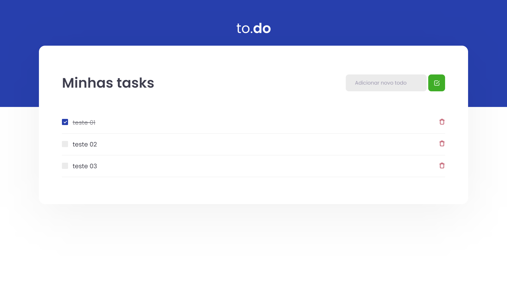

<h1 align="center">
  to.do
</h1>

<p align="center">
  <a href="#-features">Features</a>&nbsp;&nbsp;&nbsp;|&nbsp;&nbsp;&nbsp;
  <a href="#-tecnologias">Technologies</a>&nbsp;&nbsp;&nbsp;|&nbsp;&nbsp;&nbsp;
  <a href="#-project">Project</a>&nbsp;&nbsp;&nbsp;|&nbsp;&nbsp;&nbsp;
  <a href="#-starting">Starting</a>&nbsp;&nbsp;&nbsp;|&nbsp;&nbsp;&nbsp;
  <a href="#memo-license">License</a>
</p>

<p align="center">
  
  
  

  
</p>

<br>

<p align="center">
  
</p>

## ✨ Features

✔️ Create tasks\
✔️ Check tasks complete\
✔️ Delete tasks

## 🚀 Technologies

The following tools were used in this project:

<div style="display: inline_block">


</div>

## 💻 Project

A simple to-do list made with ReactJS and Typescript in order to practice handling a state.

## 🏁 Starting

```bash
# Clone this project
$ git clone https://github.com/mb4ndeira/to-do_react
# Access
$ cd to-do_react
# Install dependencies
$ yarn
# Run the project
$ yarn dev
# The server will initialize in the <http://localhost:8080>
```

## :memo: License

This project is under license from MIT. For more details, see the [LICENSE](LICENSE) file.